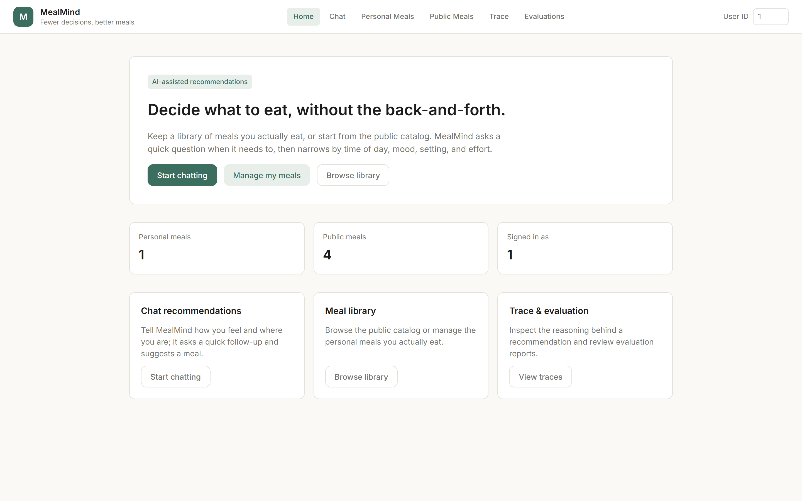
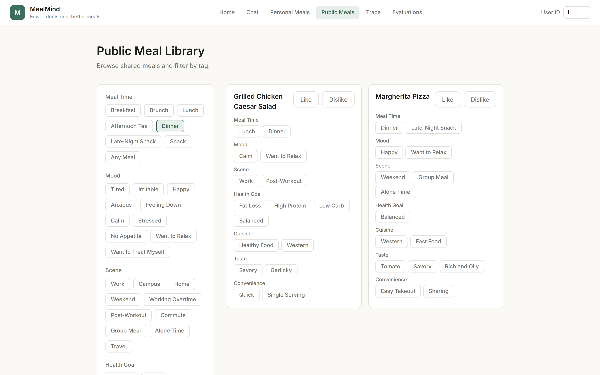
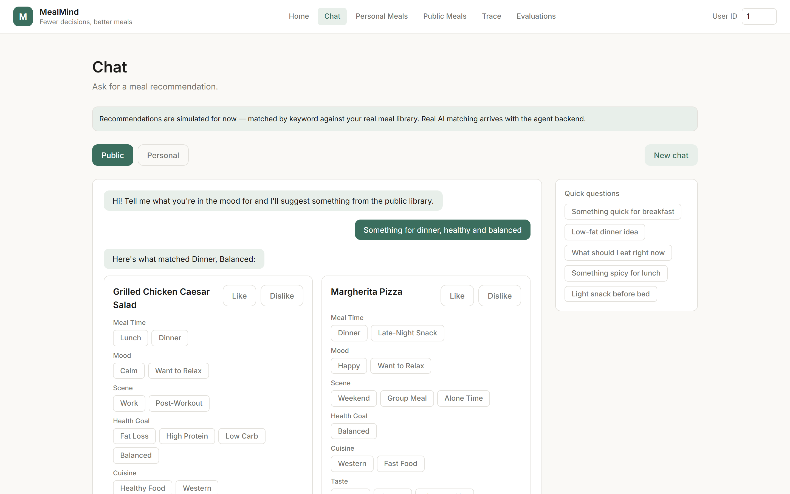

# MealMind

A personal meal-decision assistant: tell it your situation, it narrows a meal library down to a few picks and explains why.



## Background

**Problem:** "What should I eat?" is a small decision made several times a day, and it gets harder when you're juggling time of day, mood, dietary goals, and how much effort you want to put in.

**Approach:** MealMind keeps a tagged library of meals — your own personal ones or a shared public catalog — and narrows it down using seven independent dimensions (meal time, mood, scene, health goal, cuisine, taste, convenience). A rule layer decides when there's enough information to recommend versus when to ask a follow-up. Part 2 (in progress) replaces the current keyword-matched mock with real LLM agents for intent recognition, clarification, and recommendation reasoning.

## Features

- ✅ Personal and public meal libraries, tagged across 7 independent dimensions
- ✅ Shared slot-option dictionary (91 canonical tag values) driving every tag picker in the UI
- ✅ Rule-based slot merging, clarify-need detection, and health-risk keyword guarding — pure logic, unit-tested, no LLM required
- ✅ Multi-turn session state (phase, accumulated slots, last recommendations), persisted per user
- ✅ Like/Dislike feedback capture on any recommended meal
- ✅ Request trace storage with manual labeling, for future evaluation tooling
- ✅ Full React frontend: meal browsing + filtering, personal meal CRUD, a trace admin console, and a chat page (currently backed by a client-side keyword matcher standing in for the real agent)
- ✅ Flyway-managed schema — data persists across backend restarts

## Tech Stack

| Component | Technology |
|-----------|------------|
| Backend | Spring Boot 3.3 (Java 21), MyBatis |
| Database | MySQL 8.4, schema managed by Flyway |
| Frontend | React 18 + TypeScript, Vite, Tailwind CSS, React Router |
| LLM (not yet wired up) | OpenAI, via `OPENAI_API_KEY` |
| Infrastructure | Docker Compose |

## Quick Start

### Prerequisites

- Docker & Docker Compose

### Setup

```bash
# 1. Clone repository
git clone <repo-url>
cd MealMind

# 2. Copy the backend env file and fill in DB credentials
cp backend/.env.example backend/.env
# OPENAI_API_KEY / OPENAI_MODEL are reserved for Part 2 — no code reads them yet

# 3. Start MySQL, backend, and frontend together
docker compose up
```

That's it — Flyway applies the database schema automatically on backend startup, no manual migration step needed.

### Access the App

| Service | URL |
|---------|-----|
| Frontend | http://localhost:5173 |
| Backend API | http://localhost:8080/api/v1/ |
| MySQL | localhost:3307 (mapped from the container's 3306) |

The frontend container runs the Vite dev server with the source directory mounted in, so code changes hot-reload without rebuilding the image.

## The 7 Tag Dimensions

Every meal — personal or public — carries tags across seven independent dimensions, each backed by a canonical option list in `slot_option`:

| Dimension | Example values |
|-----------|-----------------|
| Meal Time | Breakfast, Lunch, Dinner, Late-Night Snack |
| Mood | Tired, Happy, Stressed, Want to Relax |
| Scene | Work, Home, Weekend, Commute |
| Health Goal | Fat Loss, High Protein, Low Carb, Balanced |
| Cuisine | Chinese, Italian, Mexican, Thai, Japanese, Western |
| Taste | Spicy, Sweet, Savory, Umami |
| Convenience | Quick, Easy Takeout, Meal-Prep Friendly |

A meal can carry multiple tags per dimension. Filtering (in the Public Meals browser and, eventually, in real recommendation matching) treats tags within one dimension as OR and different dimensions as AND — e.g. `Meal Time: Breakfast OR Brunch` AND `Health Goal: Light`.



## Chat (mocked)

The Chat page runs the full conversational UI — sessions, quick replies, Like/Dislike feedback — against a client-side keyword matcher standing in for the real agent until Part 2 lands (see [Roadmap](#roadmap-part-2)).



## API Endpoints

### Meals

```bash
GET    /api/v1/meals/public              # Browse the shared public library (read-only)
GET    /api/v1/meals/personal            # List the current user's own meals
POST   /api/v1/meals/personal            # Create a personal meal
PUT    /api/v1/meals/personal/{mealId}   # Update a personal meal
DELETE /api/v1/meals/personal/{mealId}   # Delete a personal meal
```

Requests that act on personal data expect an `X-User-Id` header.

### Slot Options

```bash
GET /api/v1/slot-options   # The canonical tag dictionary for all 7 dimensions
```

### Sessions

```bash
POST /api/v1/sessions   # Start a new conversation session (phase/slots/last recommendations)
```

### Feedback

```bash
POST /api/v1/feedback   # Record a Like/Dislike (or other) reaction to a recommended meal
```

### Trace (debug / evaluation)

```bash
GET /api/v1/debug/traces/{traceId}                 # Fetch one request trace
GET /api/v1/debug/sessions/{sessionId}/traces       # All traces for a session
GET /api/v1/debug/traces?startAt=&endAt=            # Traces in a time range, optionally unlabeled-only
PUT /api/v1/debug/traces/{traceId}/label            # Attach a human-labeled "expected answer"
```

## Running Tests

```bash
# Backend: unit + integration tests (needs a reachable MySQL matching application.yml)
cd backend && mvn test

# Frontend: type-check + production build (no dedicated test suite yet)
cd frontend && npm run build
```

## Common Commands

### Stop Services

```bash
# Stop all containers (keeps data)
docker compose down

# Stop all containers and remove volumes (full cleanup, deletes database data)
docker compose down -v
```

### Logs

```bash
docker compose logs -f mysql             # Database logs
docker compose logs -f mealmind-backend  # Backend logs
docker compose logs -f frontend          # Frontend dev server logs
```

### Port Conflicts

If you get a "port already in use" error:

```bash
# Check what's using port 3307 (MySQL), 8080 (backend), or 5173 (frontend)
lsof -i :3307
lsof -i :8080
lsof -i :5173

# Kill the process using a port
lsof -ti :8080 | xargs kill -9
```

(On Windows without WSL, use `netstat -ano | findstr :8080` to find the PID, then `taskkill /PID <pid> /F`.)

### Database

```bash
# Access the MySQL shell
docker compose exec mysql mysql -u mealmind -p mealmind

# See which migrations Flyway has applied
docker compose exec mysql mysql -u mealmind -p mealmind -e "SELECT * FROM flyway_schema_history;"
```

Schema changes are Flyway migrations under `backend/src/main/resources/db/migration/`. Never edit an already-applied migration file — add a new `V2__xxx.sql`, `V3__xxx.sql`, etc.

## Environment Variables

See `backend/.env.example` for the full list.

| Variable | Description |
|----------|-------------|
| `SPRING_DATASOURCE_URL` | MySQL connection string |
| `SPRING_DATASOURCE_USERNAME` | MySQL user |
| `SPRING_DATASOURCE_PASSWORD` | MySQL password |
| `OPENAI_API_KEY` | Reserved for Part 2 (LLM agents) — not read by any code yet |
| `OPENAI_MODEL` | Reserved for Part 2 — not read by any code yet |
| `VITE_API_PROXY_TARGET` | Backend origin the frontend dev server proxies `/api` to (set by Docker Compose) |

## Architecture

```
┌────────────┐        ┌────────────────┐        ┌────────────┐
│  Frontend  │──────▶│  Spring Boot   │──────▶│   MySQL    │
│  (React)   │◀──────│   REST API     │◀──────│  (Flyway-  │
└────────────┘        └────────────────┘        │  managed)  │
                                                   └────────────┘
```

**Current data flow:** the frontend calls the REST API directly; there is no queue, worker, or LLM in the loop yet. The Chat page's "recommendation" step runs entirely client-side (keyword matching against already-fetched meals) as a placeholder.

**Part 2 (planned):** an Orchestrator service will sit behind a new chat endpoint, routing each turn through an IntentAgent → ClarifyAgent → RecommendResponseAgent pipeline (backed by an LLM), reusing the rule services (slot merge, clarify-need check, risk guard) that already exist.

## Project Structure

```
MealMind/
├── backend/
│   ├── src/main/java/com/mealmind/
│   │   ├── controller/       # REST controllers: meal, slot, session, feedback, trace
│   │   ├── service/          # Business/rule logic: meal, slot, clarify, risk, session, feedback, trace
│   │   ├── mapper/           # MyBatis mapper interfaces
│   │   ├── entity/           # Persistence row objects
│   │   ├── model/            # Domain objects (e.g. SlotBundle)
│   │   ├── dto/               # Request/response DTOs, grouped by feature
│   │   ├── enums/ exception/ constants/ util/
│   ├── src/main/resources/
│   │   ├── db/migration/     # Flyway migrations (V1__baseline.sql, ...)
│   │   └── mapper/            # MyBatis XML
│   └── src/test/             # Unit + integration tests
├── frontend/
│   └── src/
│       ├── pages/             # Home, Chat, PersonalMeals, PublicMeals, Trace, Evaluations
│       ├── components/        # Shared UI: Button, Chip, MealCard, FeedbackButtons, DimensionChipGroup, ...
│       ├── api/                # Typed API client functions
│       ├── lib/                # Client-side utilities (session handling, mock chat reply, filters)
│       └── types/              # Shared TypeScript types
├── ai-service/    # Reserved for Part 2 agent/prompt tooling (empty for now)
├── evaluation/    # Reserved for golden-case evaluation scripts (empty for now)
├── docs/          # Screenshots
└── docker-compose.yml
```

## Roadmap (Part 2)

Part 1 (this repo's current state) is meal management, rule-based logic, and a full frontend — everything that doesn't require an LLM. The following are intentionally not built yet:

| Feature | Current State | Planned |
|---------|----------------|---------|
| **Intent recognition** | Frontend keyword-matches the message locally | Real IntentAgent (LLM) recognizing intent + extracting slots |
| **Clarifying questions** | Rule engine decides when info is missing; canned phrasing | ClarifyAgent generates a natural-language follow-up |
| **Recommendation reasoning** | Mock picks a few tag-matching meals with canned text | RecommendResponseAgent produces a reason and reply per recommendation |
| **Multi-turn orchestration** | Not implemented | Orchestrator state machine wiring intent → clarify → recommend, reusing the existing rule services |
| **Evaluation reports** | Route reserved, page shows a placeholder | EvaluationJudge scoring + report generation over labeled traces |
| **Automatic tracing** | Table + manual label API only; nothing writes a row automatically yet | Trace events captured automatically for every agent turn |
| **Authentication** | `X-User-Id` header, no real login | Not yet designed — not required to build Part 2 |
