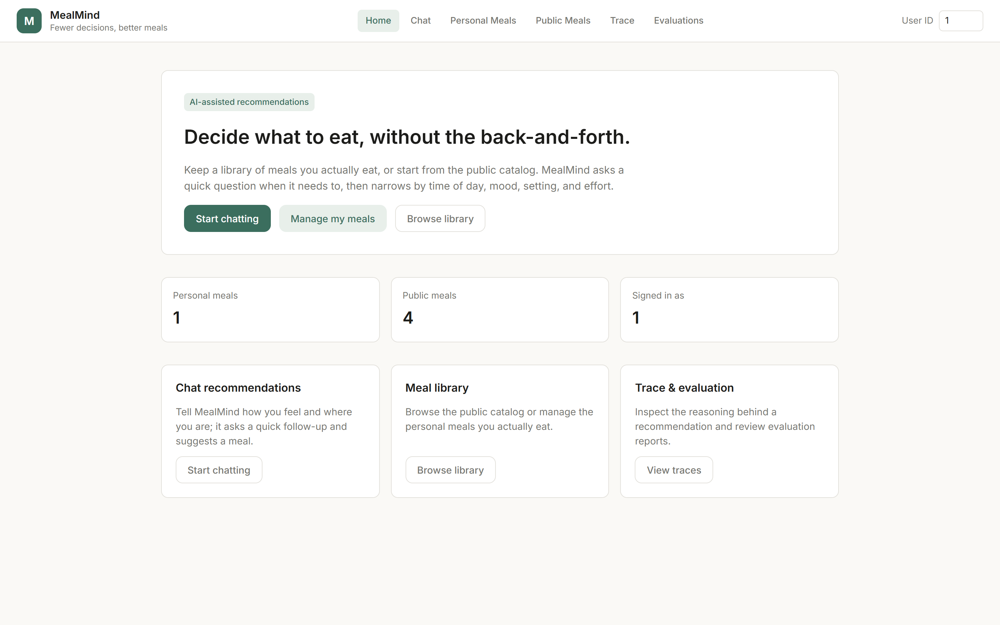
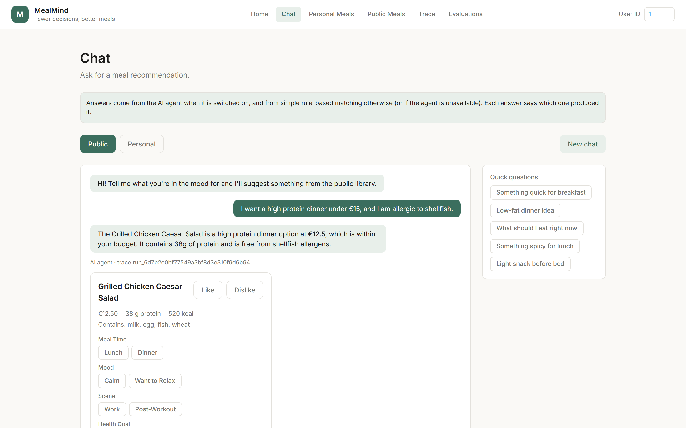
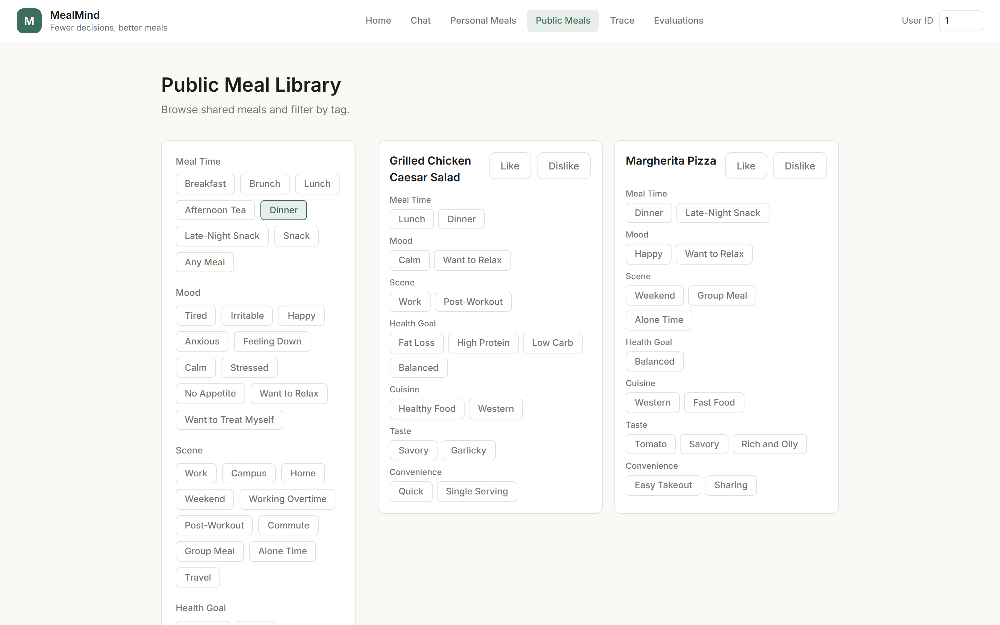

# MealMind

A personal meal-decision assistant: tell it your situation, it narrows a meal library down to a few picks and explains why.



## Background

**Problem:** "What should I eat?" is a small decision made several times a day, and it gets harder when you're juggling time of day, mood, dietary goals, budget, allergies, and how much effort you want to put in.

**Approach:** MealMind keeps a tagged library of meals — your own personal ones or a shared public catalog — with per-serving facts (price in €, protein, calories, allergens). Rules do what rules do well: slot merging, deciding when to ask a follow-up, a medical-topic safety gate. One tool-calling **AI agent** does the part that depends on the data — searching the library, loosening soft filters, and explaining the pick — and its answer is only shown if a code-level verifier confirms the budget, the allergens and every factual claim. If the agent is off or fails, a rule-based recommender answers instead.

## Features

- ✅ Personal and public meal libraries, tagged across 7 independent dimensions, with price, protein, calories and allergens per meal (unknown values stay unknown)
- ✅ Hard constraints (budget, allergens) applied in SQL; a meal with an unknown price or unknown allergens never satisfies a constraint that is set
- ✅ Rule-based slot merging, clarify-need detection and health-risk keyword guarding — pure logic, unit-tested, no LLM required
- ✅ Chat backed by `POST /api/v1/sessions/{id}/recommend`: AI agent behind a feature flag, automatic fallback to the rule-based recommender
- ✅ Tool-calling agent in a Python service (`ai-service`): hand-written loop and an equivalent LangGraph loop, strict structured output, enforced verification, pause-and-ask with a SQLite checkpointer
- ✅ Every agent run stored as a trace and viewable in the Trace page
- ✅ Offline evaluation harness (synthetic golden set, baseline vs agent) and an Evaluations page to browse its results
- ✅ Multi-turn session state, Like/Dislike feedback, request traces with manual labeling
- ✅ Flyway-managed schema — data persists across backend restarts

## Tech Stack

| Component | Technology |
|-----------|------------|
| Backend | Spring Boot 3.3 (Java 21), MyBatis |
| Database | MySQL 8.4, schema managed by Flyway |
| Frontend | React 18 + TypeScript, Vite, Tailwind CSS, React Router |
| AI service | Python 3.12, FastAPI, OpenAI API (`gpt-4o-mini` by default), LangGraph, SQLite (checkpoints) |
| Infrastructure | Docker Compose |

## Quick Start

### Prerequisites

- Docker & Docker Compose
- An OpenAI API key — only if you want the AI agent; everything else works without one

### Setup

```bash
# 1. Clone repository
git clone <repo-url>
cd MealMind

# 2. Copy the env file. Add OPENAI_API_KEY to use the agent. (The database values in it are only
#    used when the backend runs outside Docker; Compose sets its own.)
cp backend/.env.example backend/.env

# 3. Start MySQL, backend, ai-service and frontend together.
#    --env-file passes ONLY the LLM variables and the switches into the containers.
docker compose --env-file backend/.env up --build
```

Flyway applies the database schema on backend startup; there is no manual migration step.

By default the chat uses the rule-based recommender. To let the AI agent answer, set `OPENAI_API_KEY` and `MEALMIND_AGENT_ENABLED=true` in `backend/.env` and start Compose again. **This spends real API credit** (about $0.003 per recommendation with the default model). Any agent failure still falls back to the rules, so a missing key or a stopped ai-service never breaks the chat.

Try the endpoint directly (add `?mode=rules` to force the rule-based path for one request):

```bash
SID=$(curl -s -X POST "http://localhost:8080/api/v1/sessions?sourceMode=PUBLIC" | python -c "import sys,json;print(json.load(sys.stdin)['sessionId'])")
curl -s -X POST "http://localhost:8080/api/v1/sessions/$SID/recommend" -H "Content-Type: application/json" \
  -d '{"message":"high protein dinner under €15, allergic to shellfish"}'
```

### Access the App

| Service | URL |
|---------|-----|
| Frontend | http://localhost:5173 |
| Evaluations page | http://localhost:5173/admin/evaluations |
| Backend API | http://localhost:8080/api/v1/ |
| MySQL | localhost:3307 (mapped from the container's 3306) |
| AI service | http://127.0.0.1:8000 (this machine only; no authentication, spends real API credit) |

The frontend container runs the Vite dev server with the source directory mounted in, so code changes hot-reload without rebuilding the image.

## Chat

The chat page sends each message to the recommend endpoint. When the agent answers, the reply is labelled `AI agent · trace …` (find the stored trace in the Trace page by session id, or fetch it with `GET /api/v1/debug/traces/{traceId}`); otherwise a rule-based recommender answers and the label says why (for example `Rule-based answer · the AI agent was unavailable (AGENT_TIMEOUT)`). Like/Dislike feedback works on both.



## How the AI Agent Works

```
message ─▶ Spring Boot ──▶ safety gate (medical topics) ──▶ ai-service (agent loop)
              ▲                                                 │  tools: search_meals · get_recent_feedback · lookup_nutrition
              │                                                 │  (search_meals runs in the backend: budget and allergens in SQL)
              │                                                 ▼
              │                        verifier: budget, allergens, every factual claim checked against the meal's data
              │                                                 │ verified answer only
              └── re-load the meal, re-check budget/allergens ◀─┘     any failure ─▶ rule-based recommender
```

- **One agent, one step.** The agent is used only for generating the recommendation. Sessions, feedback, CRUD and the safety gate stay deterministic code.
- **Nothing unverified is shown.** The model must answer in a strict JSON schema; claims are typed (`PRICE`, `ALLERGEN_FREE`, ...) so they can be checked against the meal. A draft that fails verification is sent back for correction, and after the allowed corrections it is withheld, never displayed.
- **Backend double-checks.** The Java side loads the chosen meal itself (it must be visible to that user) and re-checks it against the budget and allergens it reads from the user's message, failing closed on unknown facts.
- **Fallback with a reason.** Timeouts, connection errors, HTTP errors, unreadable or unverified answers all fall back to rules; the response carries `fallbackReason`.
- **Bounded.** Round limit, duplicate-call guard, per-request deadline and spend cap ($0.05) in ai-service; connect/read timeouts in the backend.
- **Two interchangeable loops.** `AGENT_ENGINE=handwritten` (default) or `langgraph`, covered by the same scenario tests. Only the LangGraph one supports pause-and-ask: when no meal fits the budget, a run can pause, ask whether to raise it, and resume after a restart (`POST /v1/recommend` with `allow_questions`, then `POST /v1/recommend/{thread_id}/resume`). Allergen limits are never offered for relaxing. The chat does not use this yet.

## Evaluation

`evaluation/` holds a **synthetic** golden set (40 invented dishes, 40 cases) and a harness that runs three arms with the same model, temperature and facts: **A** one model call with the whole menu, **B** A plus an oracle verifier, **C** the agent. Results are browsable on the Evaluations page.

34 cases × 3 repeats, `gpt-4o-mini`, temperature 0 (6 cases are stopped by the safety gate before any arm runs):

| | A single call | B + oracle verifier | C agent |
|---|---|---|---|
| Unsafe answer | 30.4% (31/102) | 0.0% (0/102) | 2.9% (3/102) |
| Correct outcome | 69.6% (71/102) | 74.5% (76/102) | 91.2% (93/102) |
| Said "nothing fits" when a meal existed | 0.0% | 24.5% (25/102) | 0.0% |
| Model cost per run | $0.00085 | $0.00117 | $0.00248 |

**Read these numbers carefully.** The data is synthetic, so they say how each arm handles edge cases, not how accurate any arm is on real menus. It is one run (not replicated), and repeats of a case are not independent. "Unsafe" means a shown answer that breaks a constraint, makes a claim the check rejects, or invents a dish (no arm invented a dish). The verifier alone removes unsafe answers but over-refuses; the agent's 3 unsafe runs were all one case, where a high-protein requirement is not checked by the verifier. Details: [`docs/eval-notes.md`](docs/eval-notes.md) and the raw run in [`evaluation/results/20261005-171415/`](evaluation/results/20261005-171415/).

```bash
cd ai-service && python -m venv .venv && source .venv/bin/activate && pip install -e ".[dev]"   # once; Windows: .venv\Scripts\activate
python ../evaluation/run_eval.py --dry-run                 # plan and cost estimate, nothing is sent
python ../evaluation/run_eval.py --arms A,B,C --repeats 3  # the real run: spends real API credit (capped, default $2)
python ../evaluation/recompute_headline.py                 # recount the headline numbers from a run's raw runs.jsonl, free
```

## The 7 Tag Dimensions

Every meal — personal or public — carries tags across seven independent dimensions, each backed by a canonical option list in `slot_option`:

| Dimension | Example values |
|-----------|-----------------|
| Meal Time | Breakfast, Lunch, Dinner, Late-Night Snack |
| Mood | Tired, Happy, Stressed, Want to Relax |
| Scene | Work, Home, Weekend, Commute |
| Health Goal | Fat Loss, High Protein, Low Carb, Balanced |
| Cuisine | Chinese, Italian, Mexican, Thai, Japanese, Western |
| Taste | Spicy, Sweet, Savory, Umami |
| Convenience | Quick, Easy Takeout, Meal-Prep Friendly |

A meal can carry multiple tags per dimension. Filtering and recommendation matching treat tags within one dimension as OR and different dimensions as AND — e.g. `Meal Time: Breakfast OR Brunch` AND `Health Goal: Light`. Budget and allergens are separate hard constraints, not tags.



## API Endpoints

Requests that act on personal data expect an `X-User-Id` header (default `1`).

```bash
# Meals
GET    /api/v1/meals/public              # Browse the shared public library (read-only)
GET    /api/v1/meals/personal            # List the current user's own meals
POST   /api/v1/meals/personal            # Create a personal meal
PUT    /api/v1/meals/personal/{mealId}   # Update a personal meal
DELETE /api/v1/meals/personal/{mealId}   # Delete a personal meal

# Slot options, sessions, feedback
GET  /api/v1/slot-options                          # The canonical tag dictionary for all 7 dimensions
POST /api/v1/sessions                              # Start a conversation session (?sourceMode=PUBLIC|PERSONAL)
POST /api/v1/sessions/{sessionId}/recommend        # One chat turn: {"message": "..."}; ?mode=rules skips the agent
POST /api/v1/feedback                              # Record a Like/Dislike reaction to a recommended meal

# Trace (debug)
GET /api/v1/debug/traces/{traceId}                 # Fetch one request trace
GET /api/v1/debug/sessions/{sessionId}/traces      # All traces for a session
GET /api/v1/debug/traces?startAt=&endAt=           # Traces in a time range, optionally unlabeled-only
PUT /api/v1/debug/traces/{traceId}/label           # Attach a human-labeled "expected answer"

# Evaluations (read-only)
GET /api/v1/evaluations                            # Available runs
GET /api/v1/evaluations/{runId}                    # One run: metrics per arm, breakdown, comparisons, limits
GET /api/v1/evaluations/{runId}/cases              # Cases of a run (?category=&limit=&offset=)
GET /api/v1/evaluations/{runId}/cases/{caseId}     # Every answer of every arm for one case
```

**Internal API (for ai-service only):** `POST /internal/v1/meals/search`, `GET /internal/v1/users/{userId}/recent-feedback`, `POST /internal/v1/risk/check`, `POST /internal/v1/traces`. It has **no authentication**: do not expose the backend port to a network you do not trust.

**ai-service** (`http://127.0.0.1:8000`): `GET /health`, `POST /ping` (one tiny model call, spends credit), `POST /v1/recommend`, `POST /v1/recommend/{thread_id}/resume`.

## Running Tests

```bash
# Backend: unit + integration tests (needs a reachable MySQL; the datasource comes from backend/.env or SPRING_DATASOURCE_*)
cd backend && mvn test

# AI service: Python 3.11+ (tests that need a running backend are skipped otherwise; no real API calls are made)
cd ai-service
python -m venv .venv && source .venv/bin/activate      # Windows: .venv\Scripts\activate
pip install -e ".[dev]"
pytest

# Frontend: type-check + production build (no dedicated test suite yet)
cd frontend && npm run build
```

## Common Commands

### Stop Services

```bash
# Stop all containers (keeps data)
docker compose down

# Stop all containers and remove volumes (full cleanup, deletes database data and saved agent checkpoints)
docker compose down -v
```

### Logs

```bash
docker compose logs -f mysql             # Database logs
docker compose logs -f mealmind-backend  # Backend logs
docker compose logs -f ai-service        # AI service logs
docker compose logs -f frontend          # Frontend dev server logs
```

### Run Without Docker

```bash
cd backend && mvn spring-boot:run                       # needs a MySQL; reads backend/.env
cd ai-service && uvicorn app.main:app --host 127.0.0.1 --port 8000   # in the venv from "Running Tests"; reads ../backend/.env
cd frontend && npm install && npm run dev
```

### Port Conflicts

If you get a "port already in use" error:

```bash
# Check what's using port 3307 (MySQL), 8080 (backend), 8000 (ai-service) or 5173 (frontend)
lsof -i :3307
lsof -i :8080
lsof -i :8000
lsof -i :5173

# Kill the process using a port
lsof -ti :8080 | xargs kill -9
```

(On Windows without WSL, use `netstat -ano | findstr :8080` to find the PID, then `taskkill /PID <pid> /F`.)

### Database

```bash
# Access the MySQL shell
docker compose exec mysql mysql -u mealmind -p mealmind

# See which migrations Flyway has applied
docker compose exec mysql mysql -u mealmind -p mealmind -e "SELECT * FROM flyway_schema_history;"
```

Schema changes are Flyway migrations under `backend/src/main/resources/db/migration/`. Never edit an already-applied migration file — add a new `V5__xxx.sql`, `V6__xxx.sql`, etc.

## Environment Variables

See `backend/.env.example` for the variables you normally set. Docker Compose passes into the containers only `OPENAI_API_KEY`, `OPENAI_MODEL`, `LLM_API_URL`, `AGENT_ENGINE` and `MEALMIND_AGENT_ENABLED`; every other ai-service variable keeps its default inside Docker.

**Backend (Spring Boot)**

| Variable | Default | Description |
|----------|---------|-------------|
| `SPRING_DATASOURCE_URL` / `_USERNAME` / `_PASSWORD` | `localhost:3306`, `mealmind` | MySQL connection |
| `MEALMIND_AGENT_ENABLED` | `false` | Let the chat call the AI agent; any failure falls back to rules |
| `MEALMIND_AGENT_BASE_URL` | `http://localhost:8000` | Where ai-service is |
| `MEALMIND_AGENT_CONNECT_TIMEOUT_MS` / `_READ_TIMEOUT_MS` | `2000` / `35000` | Timeouts of the call to ai-service |
| `MEALMIND_EVALUATION_RESULTS_DIR` / `_CASES_FILE` | `../evaluation/results`, `../evaluation/cases.json` | Files the Evaluations page reads (read-only) |

**AI service**

| Variable | Default | Description |
|----------|---------|-------------|
| `OPENAI_API_KEY` | empty | Empty means the agent endpoints answer 503 and the backend falls back to rules |
| `AGENT_MODEL` | `gpt-4o-mini` | Model the agent uses (recorded in every trace) |
| `OPENAI_MODEL` | none | Only used by `POST /ping` |
| `LLM_API_URL` | OpenAI | Optional full chat-completions URL of an OpenAI-compatible endpoint |
| `AGENT_ENGINE` | `handwritten` | `handwritten` or `langgraph` (pause-and-ask needs `langgraph`) |
| `AGENT_PROMPT_VERSION` | `v5` | Versioned system prompt in `ai-service/prompts/agent_system/` |
| `AGENT_MAX_ROUNDS` | `8` | Model calls per run |
| `AGENT_DEADLINE_S` / `AGENT_REQUEST_CAP_USD` | `30` / `0.05` | Wall-clock limit and spend cap of one request |
| `AGENT_CHECKPOINT_DB` | `ai-service/data/checkpoints.sqlite` | Where paused runs are saved |
| `INTERNAL_API_BASE_URL` | `http://localhost:8080` | Backend's internal API (Compose sets the service name) |

**Frontend:** `VITE_API_PROXY_TARGET` — backend origin the dev server proxies `/api` to (set by Docker Compose).

## Architecture

```
┌────────────┐      ┌─────────────────┐      ┌────────────┐
│  Frontend  │─────▶│   Spring Boot   │─────▶│   MySQL    │
│  (React)   │◀─────│    REST API     │◀─────│  (Flyway)  │
└────────────┘      └───────┬─────────┘      └────────────┘
                            │  ▲
            POST /v1/recommend │ │ /internal/v1/*  (meal search, feedback, risk check, traces)
                            ▼  │
                    ┌─────────────────┐      ┌────────────┐
                    │   ai-service    │─────▶│   OpenAI   │
                    │ (FastAPI agent) │◀─────│    API     │
                    └─────────────────┘      └────────────┘
```

**Data flow of a chat turn:** the backend loads the session, runs the safety gate, updates the slots with rules, and — if the agent is enabled — asks ai-service for a recommendation. The agent searches meals through the backend's internal API, so budget and allergen filtering happen in SQL; its answer is verified, then re-checked by the backend before it is returned. ai-service is stateless apart from saved pause-and-ask runs. Every finished agent run is written to the trace table through the backend.

## Project Structure

```
MealMind/
├── backend/
│   ├── src/main/java/com/mealmind/
│   │   ├── controller/       # REST controllers: meal, slot, session (+ recommend), feedback, trace, evaluation, internal
│   │   ├── service/          # Business/rule logic: meal, slot, clarify, risk, session, feedback, trace, recommend, evaluation
│   │   ├── mapper/           # MyBatis mapper interfaces
│   │   ├── entity/           # Persistence row objects
│   │   ├── model/            # Domain objects (e.g. SlotBundle, MealFacts)
│   │   ├── dto/               # Request/response DTOs, grouped by feature
│   │   ├── config/ enums/ exception/ constants/ util/
│   ├── src/main/resources/
│   │   ├── db/migration/     # Flyway migrations (V1__baseline.sql, ...)
│   │   └── mapper/            # MyBatis XML
│   └── src/test/             # Unit + integration tests
├── frontend/
│   └── src/
│       ├── pages/             # Home, Chat, PersonalMeals, PublicMeals, Trace, Evaluations
│       ├── components/        # Shared UI: Button, Chip, MealCard, FeedbackButtons, DimensionChipGroup, ...
│       ├── api/                # Typed API client functions
│       ├── lib/                # Client-side utilities (session handling, filters)
│       └── types/              # Shared TypeScript types
├── ai-service/
│   ├── app/           # FastAPI app, agent loops (agent.py, agent_graph.py), tools, verifier, prompts loader
│   ├── prompts/       # Versioned system prompts (agent_system/, baseline/)
│   ├── scripts/       # Demos: tools, agent, LangGraph steps, pause-and-resume
│   └── tests/         # pytest, with a scripted fake model (no network, no cost)
├── evaluation/        # Synthetic golden set, harness (run_eval.py), and results/
├── docs/              # Screenshots and evaluation notes
└── docker-compose.yml
```

## Status, Limitations and Next Steps

**Built:** the meal libraries with facts and hard constraints, rule services, the agent with enforced verification behind a feature flag, a fallback path, traces, the evaluation harness and its page.

**Known limitations**

- The evaluation uses synthetic data and a single run (see [Evaluation](#evaluation)); the agent still has gaps — it does not check a "high protein" requirement stated in free text, and sometimes leaves a typed claim value empty, which withholds an otherwise good answer.
- Slot extraction in the rule-based path is whole-word vocabulary matching (no synonyms). The medical-topic gate is keyword-based and also blocks harmless messages that contain a word such as "treat".
- No authentication: `X-User-Id` is a plain header, and the internal API and ai-service have none. ai-service is published on localhost only.
- Pause-and-ask works in ai-service only; the chat page and the Java backend do not use it, and abandoned paused runs are never cleaned up.
- Latency is not reported: the measured durations of the evaluation run include rate-limit waiting.

**Next steps**

- Add the missing protein-requirement check to the verifier and fix the empty-claim-value case, then repeat the evaluation (a second full run would also show run-to-run variation).
- Connect pause-and-ask to the Java chat flow and the chat page.
- Add authentication for the internal API and ai-service, and real login instead of `X-User-Id`.
- Score labeled real traces through the same Evaluations page and API shape.
- Better slot extraction and a less blunt safety gate.
